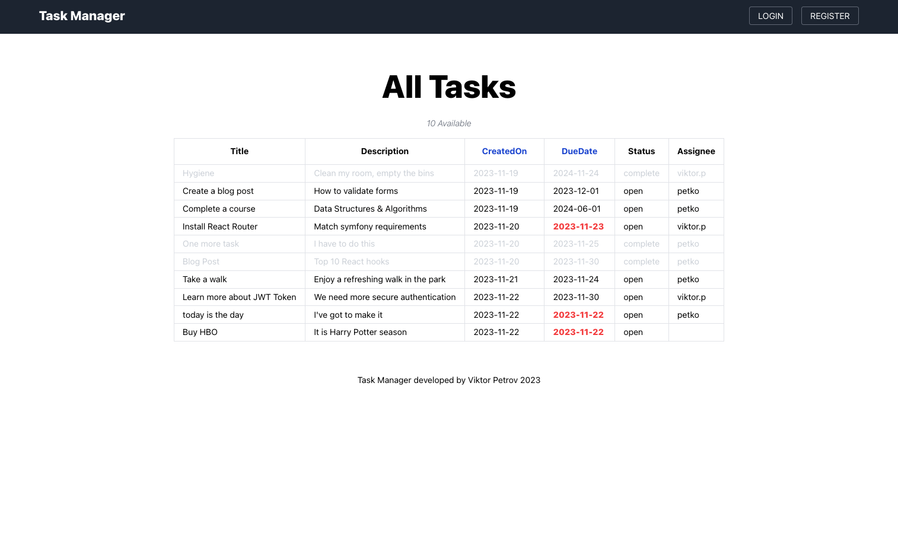
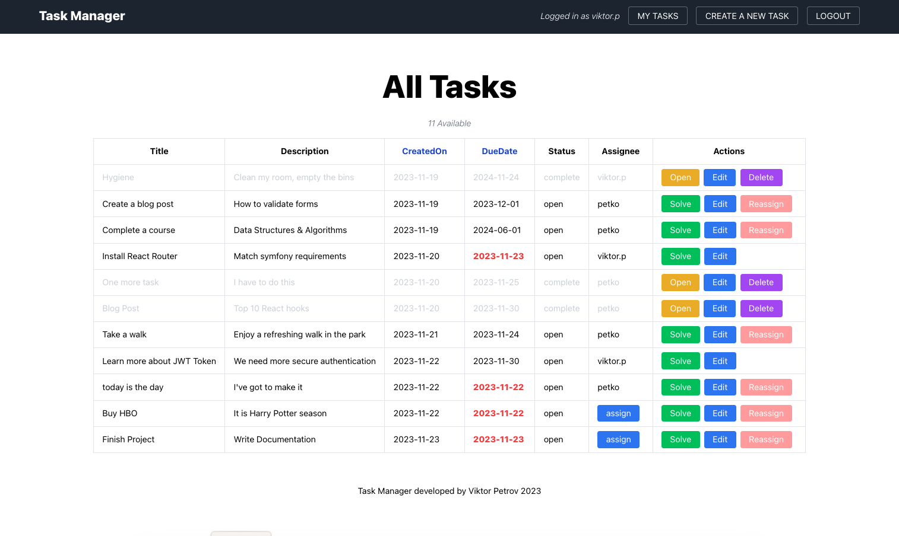
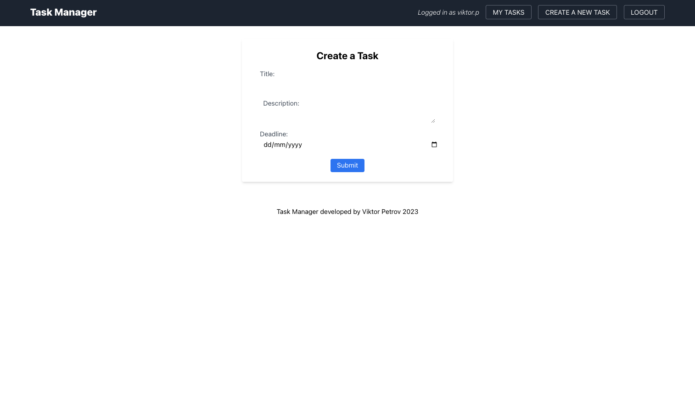
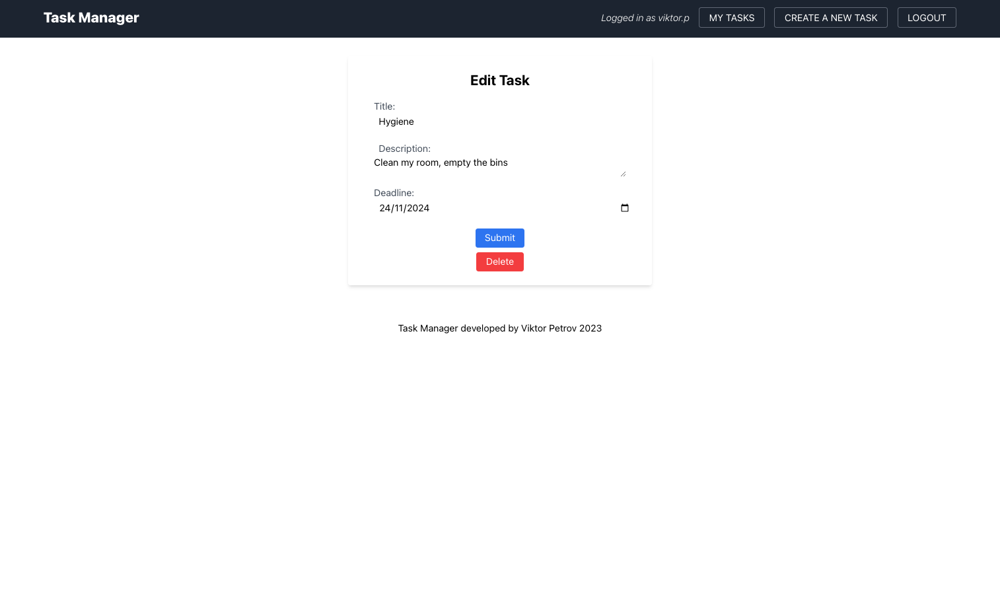
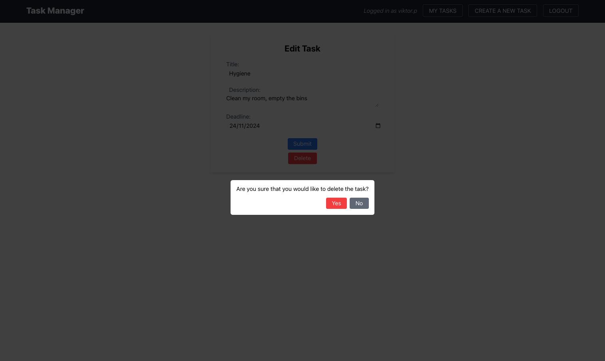
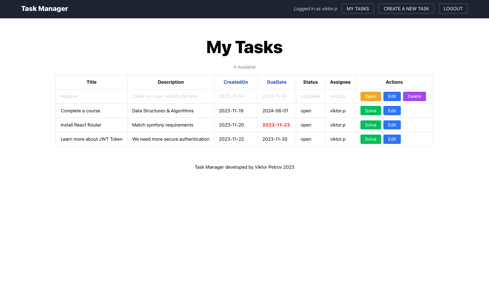
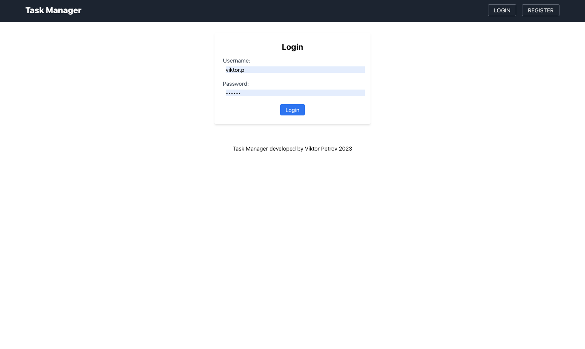
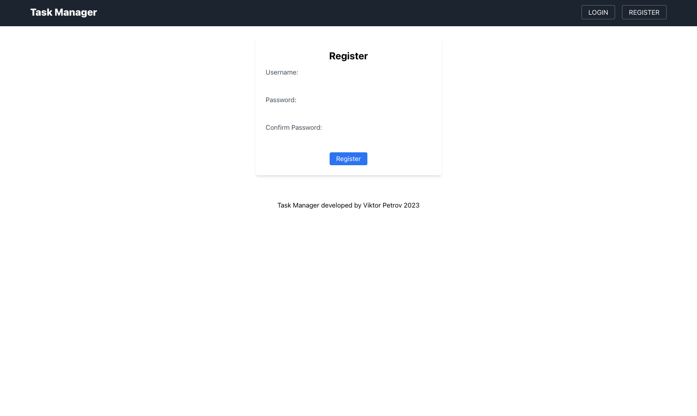

# TaskManager

A single page application where users can manage tasks.

Original Repository: https://gitlab.com/viktor.mp/task-list-symfony-php

## Installation

1. Clone the repository.
2. Navigate to the project directory.
3. Install dependencies: `npm install` && `composer install`.
4. Add a database. Currently the project is set to my local database.
5. Run `npm run watch`.
6. Run `symfony server start` to start the server.

NOTE: Commands may vary, depending on your symfony and composer setup.

## Home Page - Public View

## Features

1. **Visibility for Non-Logged-In Users:**
   - The page is designed to be accessible to users who have not yet logged in.

2. **Task Sorting Options:**
   - Tasks are conveniently sortable by either "CreatedOn" or "DueDate" with a simple user interface.

3. **Due Date Emphasis:**
   - The "DueDate" field is highlighted in red if the task is due today, drawing attention to tasks with a higher priority.

4. **Solved Task Distinction:**
   - Solved tasks are presented with a lighter font, subtly directing focus away from them and making it easier for users to identify unresolved tasks.

## Home Page - Private View

## Task Management Features

1. **Visibility for Authenticated Users:**
   - The functionality is designed to be visible to authenticated users, ensuring a secure and personalized experience.

2. **Task Assignment:**
   - Users have the ability to assign a task to themselves, streamlining task management.

3. **Dynamic Task Actions:**
   - Task actions include:
     - Solve task
     - Open task
     - Edit task
     - Delete task
     - Reassign task

4. **Dynamic Actions Column:**
   - The actions column is dynamic, adapting based on the current state of the task. This ensures a tailored set of actions depending on the task's status.

## Create Task View

## Features

1. **Task Creation:**
   - Users can initiate the creation of a new task through this view.

2. **Required Fields:**
   - The task creation form includes the following required fields:
     - Title
     - Description
     - Deadline

3. **Deadline Validation:**
   - The deadline field is designed to ensure tasks cannot be created with a deadline in the past. Users will be prompted to select a future date.

4. **Feedback:**
   - On successful task creation user is redirected to home page. Otherwise - guidance on any errors in the provided information.

## Edit Task View

## Features

1. **Task Editing:**
   - Users can modify the details of an existing task through this view.

2. **Task Deletion:**
   - Users can delete a task, triggering a modal for confirmation before permanent deletion.

3. **Modal Confirmation:**
   - Upon selecting the delete option, a modal appears, prompting users to confirm their intention to delete the task.
  
  

## MyTasks View

## Login View

## Register View

## Areas where the project can be improved 

While the current version of the project offers essential features, there are opportunities for enhancement and expansion. Consider the following suggestions for future improvements:

1. **Filtering by Solved/Open:**
   - Implement a feature that allows users to filter tasks based on their solved or open status. This can enhance user experience by providing quick access to relevant task categories.

2. **Pagination for Task Display:**
   - Consider incorporating pagination to display tasks across multiple pages. This can optimize performance and navigation, particularly as the number of tasks increases.

3. **API Authenticated Routes:**
   - Extend the project's functionality by including API routes with authentication. This can facilitate secure communication between the front end and back end, ensuring data integrity and user privacy.

4. **JWT Authentication:**
   - Enhance security by integrating JSON Web Token (JWT) authentication. This can provide a robust and scalable solution for user authentication, offering benefits such as token-based authorization and improved security practices.

## Thanks for checking my project

